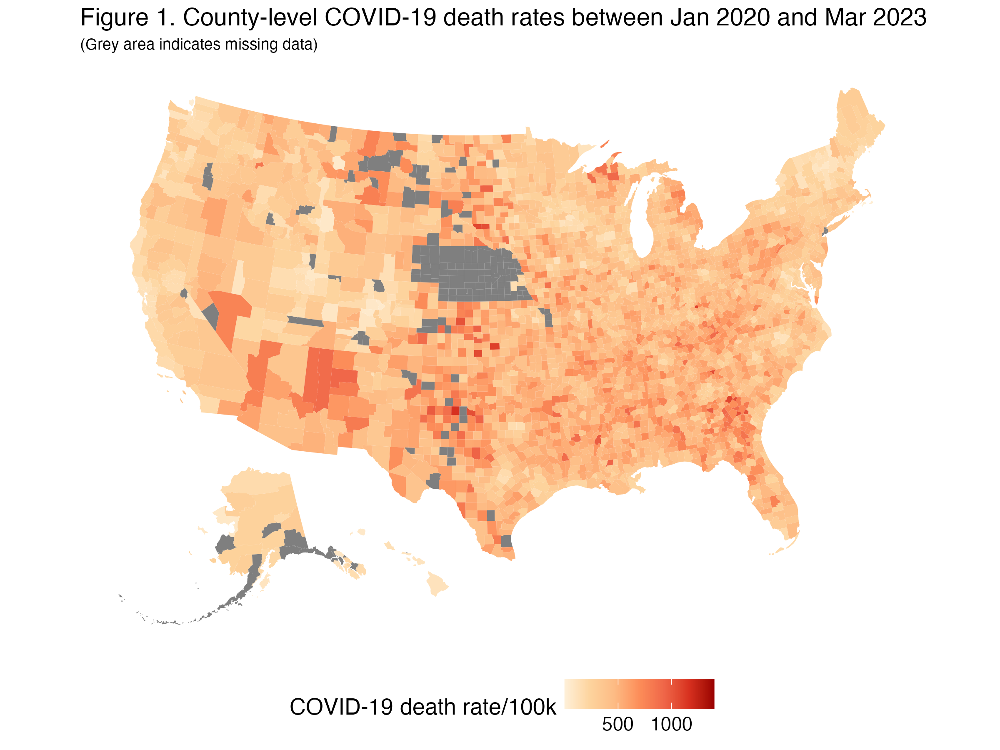
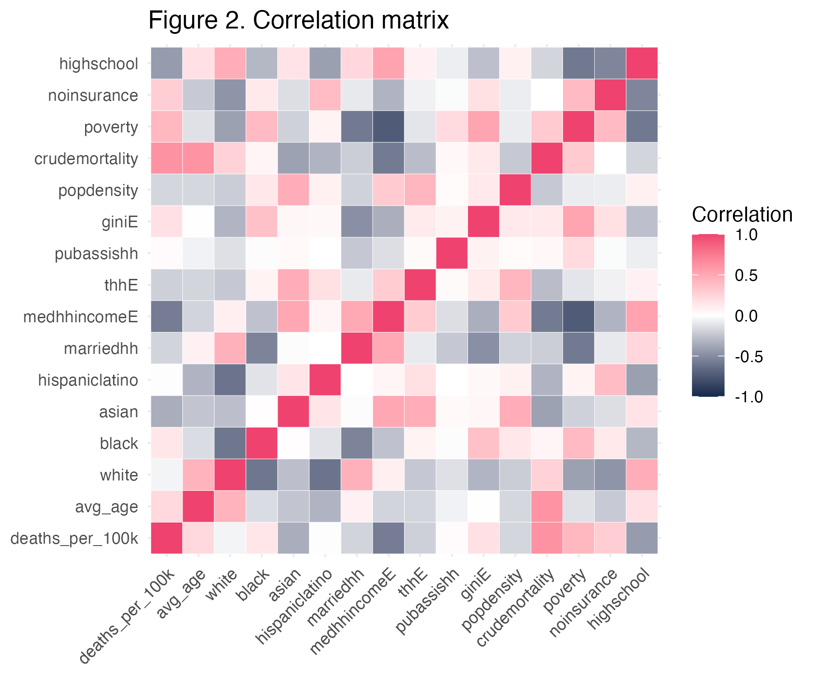
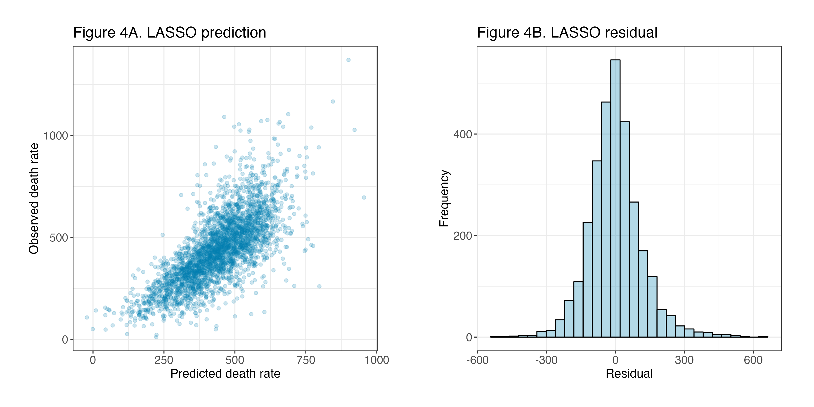

# Introduction

The COVID-19 pandemic has caused more than 1.2 million confirmed deaths in the United States as of November 2024. According to the COVID-19 case counts between January 2020 to March 2023, the county-level COVID-19 death rates are not evenly distributed across the country, ranging from the lowest death rate of 11.5 deaths/100k population to the highest of 1370.7 deaths/100k population (Figure 1). To explore the most impactful predictors of the COVID-19 mortality rate, this project used linear regression, LASSO, and elastic net methods to investigate the association between COVID-19 death rate and county-level demographics. The report first introduces data sources and data processing, followed by description of the statistical methods and key results, and ends with discussing the public health implications and limitations.

```{r, echo=FALSE, out.width="80%"}

```

# Data source

## Outcome

The outcome is the county-level overall COVID-19 death rate between January 2020 to March 2023. Publicly available death counts were downloaded from the New York Times COVID-19 data repository (https://raw.githubusercontent.com/nytimes/covid-19-data/master/us-counties-2023.csv). Weekly raw data was aggregated by the fips code, and in total 3,036 counties had non-missing death rates.

## Covariates

County-level age distribution was downloaded from CDC, which includes the proportions of population in each 5-year age group. The mean age for each county was calculated, by weighting the middle point of each age group by the proportions of population in that age group. County-level pre-COVID mortality rate was pulled from the National Center for Health Statistics Mortality Data on CDC WONDER, to capture the pre-pandemic health situation. Demographics data were pulled from the US Census 2017-2021 American Community Survey using the R `tidycensus` package. Covariates include population structure factors (population density, proportions of identifying as White/Black/Asian/Hispanic or Latino), household factors (total number of households, proportion of married households, proportion of households which needs public assistance, median household income), socioeconomic factors (proportion of population without health insurance, proportion of population with income below the poverty level, proportion of population receiving high school education, GINI index).


#Methods

The correlation matrix between the death rates and all covariates were generated to understand the univariate association between the outcome and potential predictors. Covariates with low correlation coefficients with the outcome were removed from the analysis.

#Results

From the correlation matrix (Figure 2), the outcome (`deaths_per_100k`) has low correlations with the proportion of White population (`white`), the proportion of Hispanic/Latino population (`hispaniclatino`), and the proportion of households which requires public assistance (`pubassishh`). Given that the population disparities is an important factor in public health research, only `pubassishh` was removed from further analysis.

```{r, echo=FALSE, out.width="80%"}

```


```{r}



```


#Discussion

# References:

https://www.nytimes.com/interactive/2023/us/covid-cases.html

https://covid19.census.gov/datasets/21843f238cbb46b08615fc53e19e0daf/explore


https://wonder.cdc.gov/mcd.html

